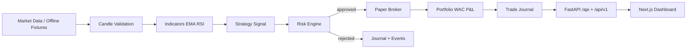

# Architecture — Paper Trading MVP

## End-to-end flow

## Safety invariants

- `TRADING_MODE` defaults to `paper`. Live execution is hard-blocked.
- `SafetyGuard` rejects live orders, futures, leverage > 1x, and withdrawals.
- Every order (including paper) passes `OrderGateway` → `RiskEngine`.
- Kill switch overrides all execution paths.
- AI modules never call brokers or gateways.
- Secrets are `SecretStr` and redacted from logs / `/config` payloads.

## Component map

| Package | Responsibility |
|---------|----------------|
| `app/core` | Settings, runtime mode, safety guard, logging, time |
| `app/market_data` | CCXT providers (Binance/Bybit), validate, normalize, persist |
| `app/indicators` | EMA, RSI, ATR (Decimal-friendly) |
| `app/strategies` | Deterministic signal generators (no LLM) |
| `app/risk` | Pre-trade checks, kill switch, sizing |
| `app/execution` | Paper broker, gateway, live gate (always deny) |
| `app/services` | Orchestrator, paper cycle, paper session, persistence |
| `app/api` | `/api/v1` + MVP `/api` aliases + dashboard roots |
| `frontend/` | Ops dashboard; BFF proxies; no secrets in browser |

## Modes

| Mode | Meaning |
|------|---------|
| PAPER | Simulated funds only (default) |
| TESTNET | Exchange testnet data/adapters (no live money) |
| LIVE | Hard-blocked in this milestone |

## Data stores

- SQLite by default (`DATABASE_URL`); Postgres via `docker compose`
- Alembic migrations `0001`–`0004`
- Process session + durable kill switch / checkpoint / cycle idempotency keys
