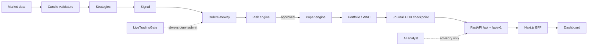

# System Design — Project Atlas

**Scope:** Personal cryptocurrency **paper** trading platform.  
**Defaults:** `ATLAS_RUNTIME_MODE=PAPER`, `TRADING_MODE=paper`, `ENABLE_LIVE_TRADING=false`.  
**Live money:** Hard-blocked in this development phase (even when checklist + credentials + `LIVE_STARTUP_ACK` are set).  
**AI:** Advisory only — never submits orders or bypasses risk.

## High-level data path

```text
Market data → candle validation → strategy → signal
  → OrderGateway → RiskEngine → paper broker → fill
  → portfolio (WAC) → journal / checkpoint → /api/v1 → Next.js dashboard
```



## Components

### Config (`app/core/config.py`)

- Pydantic settings from `.env` (see `.env.example`).
- Safety defaults: paper trading, live flag off, leverage fixed at 1.
- Invalid `TRADING_MODE` / `EXCHANGE_ENV` strings normalize to **paper** (never silent LIVE).
- `assert_startup_safe()` fails closed on LIVE attempts; raises `LiveTradingDisabledError` even when operational gates pass.
- Risk percents accept whole points or fractions (`1` and `0.01` both mean 1%).
- Money fields are `Decimal`-only; NaN/Infinity rejected.

### Market data (`app/market_data`)

- Public / offline candle feeds (Binance public REST; geo-blocks may return HTTP 451).
- Closed-candle validation (ordering, OHLC sanity) before strategy evaluation.
- Staleness threshold: `MARKET_DATA_STALE_SECONDS` (default 30).
- Paper cycles can use offline fixtures (no exchange required).

### Strategies (`app/strategies`)

Registered by ID via `registry.py`:

| ID | Module | Notes |
|----|--------|-------|
| `ema_crossover` | `ema_crossover.py` | Default paper-cycle path; ATR stops; optional RSI filter |
| `ema_trend` | `ema_trend.py` | Trend-following EMA variant |
| `rsi_mean_reversion` | `rsi_mean_reversion.py` | Long-only RSI mean reversion |
| `breakout` | `breakout.py` | Donchian-style breakout; prior window excludes current bar |

Strategies emit signals only. They must not call the paper/exchange engines directly.

### Risk (`app/risk/engine.py`)

Central gate for every actionable order:

- Symbol allowlist (`ALLOWED_SYMBOLS`, default `BTC/USDT`)
- Position / portfolio exposure, daily loss, drawdown, open-position caps
- Kill switch, cooldown, insufficient balance, consecutive losses, rate limits
- Reconciliation / market-data / risk-engine health flags can halt new orders

### Paper engine (`app/execution` paper backend + `app/services/paper_session.py`)

- Simulated fills with `PAPER_FEE_BPS` / `PAPER_SLIPPAGE_BPS`.
- Starting balance from `PAPER_STARTING_BALANCE`.
- Session hydrates kill switch, balances, positions, and cycle idempotency keys from DB on startup.
- Fill/order history lists are still largely in-process (balances/positions/kill switch are durable).

### OrderGateway (`app/execution/gateway.py`)

**Single entrypoint** for order submission:

1. `RiskEngine.evaluate(...)`
2. Reject / halt → `RiskBlockedError`
3. Optional quantity reduction
4. Backend `submit` (paper in this phase)

Orchestrator, paper cycle, and API order paths wire through this gateway.

### Live gate (`app/execution/live_gate.py`)

Checklist conditions (mode, `ENABLE_LIVE_TRADING`, `LIVE_STARTUP_ACK=I_UNDERSTAND_LIVE_TRADING_RISKS`, kill switch off, credentials, health flags, approval token).

- `checklist_complete` can be true for inspection.
- `allowed` is **always `False`** in this phase (`live_execution_hard_blocked`).

### API (`app/api`, `app/main.py`)

| Surface | Role |
|---------|------|
| `/health`, `/health/live` | Liveness (mode, kill switch) |
| `/ready`, `/health/ready` | Readiness — **probes DB**; LIVE always `not_ready` |
| `/api/v1/*` | Primary paper/portfolio/system API |
| `/api/*` + dashboard router | Dashboard-oriented routes |
| Auth routes | Dashboard login (PBKDF2) |

Mutating system/dashboard actions require `AdminAuthDep` (`X-Admin-Token` or Bearer) when `ADMIN_API_TOKEN` is set; unset token → **503 fail-closed**.

### Dashboard (`frontend/`)

- Next.js App Router + BFF under `frontend/app/api/*`.
- Browser talks only to Next; server uses `ATLAS_BACKEND_URL` + `ADMIN_API_TOKEN` for mutators.
- **Demo fallbacks** on some **read** paths when backend is down (banner shown).
- **Mutators fail closed** (orders, kill switch, etc.) — no invented APPROVED fills or fake kill-switch success.

### AI isolation (`app/ai/analyst.py`)

- `TradingAnalyst` returns payloads with `advisory: true`.
- No imports from execution submission paths; forbidden-action list documents structural limits.
- Does not change risk config or place orders.

### Database

- Alembic migrations `0001`–`0004` (SQLite default for local; Postgres via compose optional).
- Durable: `system_state` (kill switch, cycle keys), balances, positions, snapshots, trade journal tables.
- Default URL: `sqlite+aiosqlite:///./atlas.db`.
- Redis appears in compose / settings but is not required for paper REST mode (websocket optional in readiness).

### Backtesting (`app/backtesting/engine.py`)

- Shares strategy rules; SL/TP evaluated on **next bar** (not same-bar optimistic exits).
- Not a substitute for the live risk gateway path on every historical tick — treat results as simulated research only.

## Safety invariants

1. Paper is default; LIVE submission hard-blocked.
2. Every order → `OrderGateway` → risk engine.
3. Decimal money; timezone-aware UTC timestamps.
4. Secrets redacted in logs / `/config/safe`.
5. AI cannot execute.

## Related docs

- `docs/architecture/CURRENT_STATE_AUDIT.md` — honest completion status
- `docs/architecture/paper_trading_flow.md` — cycle details
- `docs/architecture/risk_controls.md` — risk rules
- `docs/operations/RUNBOOK.md` — how to run
- `docs/operations/live_trading_readiness_checklist.md` — all items remain unchecked for go-live
