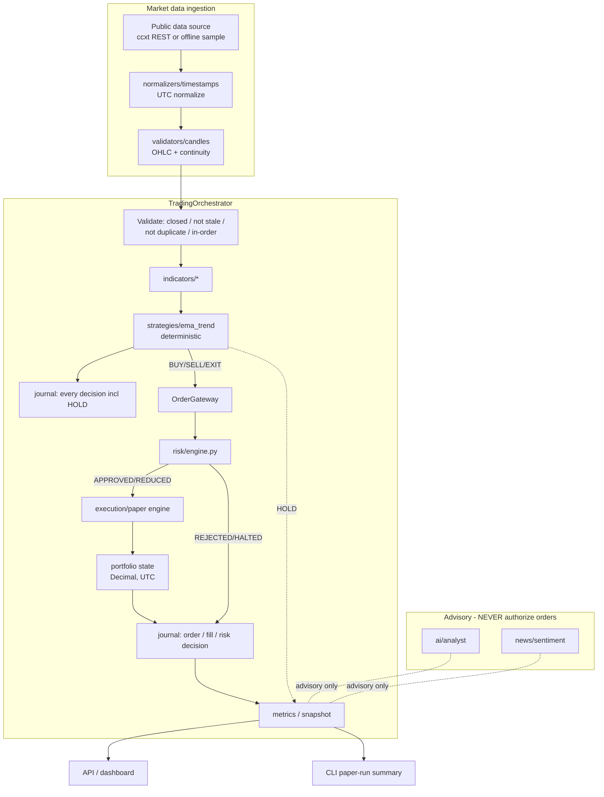
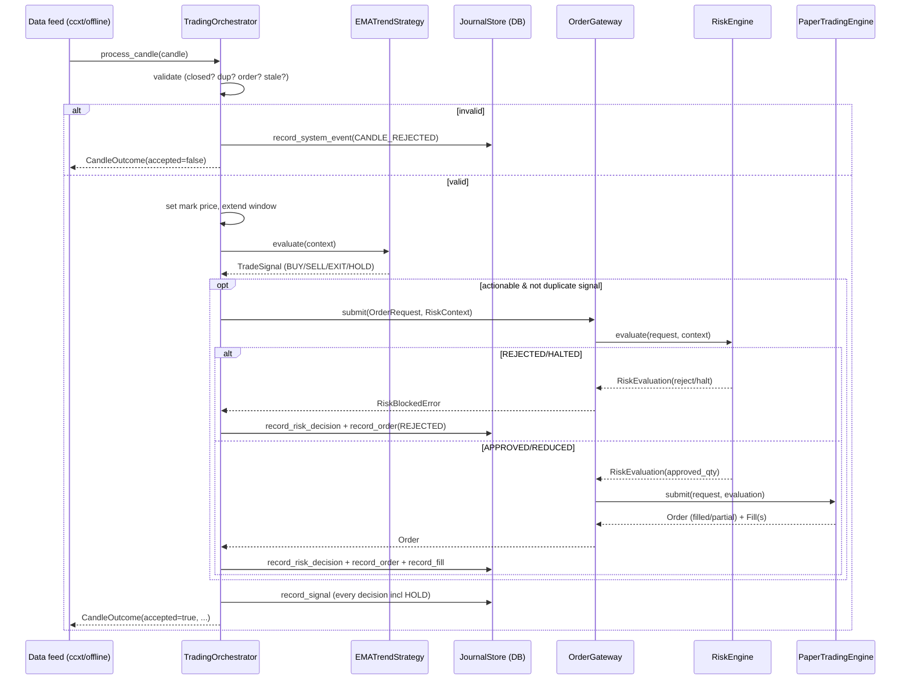

# Paper-Trading Data Flow (as implemented)

This document reflects the pipeline **as it exists after Phase 16**, centred on
`app/services/trading_orchestrator.py`. Every actionable order passes through
`app/risk/engine.py` via `OrderGateway`; AI and news never authorize execution;
live execution is unreachable in paper mode.

## Component diagram

## Sequence (one closed candle)

## Per-transition contract

| Transition | Producer | Consumer | Input → Output | Persistence | Errors | Retry | Idempotency | Health | Tests |
|---|---|---|---|---|---|---|---|---|---|
| Source → candle | ccxt / `sample_market` | orchestrator | rows → `Candle` (Decimal, UTC) | none | feed error → backoff, `errors++`, clean shutdown | bounded exp. backoff (CLI + `providers/retry`) | last-open cursor skips seen | `stats.errors` | `test_cli_paper_run`, `test_binance_provider` |
| Normalize/validate | `normalizers`, `validators` | orchestrator | `Candle` → `Candle`/reject | none | reject reason code | — | dup/gap detection | — | `test_timestamp_normalizer`, `test_candle_validators` |
| Validate (orch) | orchestrator | orchestrator | `Candle` → accept/reject | `system_events` | INCOMPLETE/DUPLICATE/OUT_OF_ORDER/STALE | — | seen-candle set + last-open | `candles_rejected` | `test_orchestrator` |
| Indicators/strategy | `indicators`, `strategies` | orchestrator | window → `TradeSignal` | `signals` (every decision) | strategy exception contained | — | signal fingerprint dedup | `errors` | `test_indicators`, `test_ema_trend_strategy`, replay |
| Risk | `OrderGateway`→`RiskEngine` | paper engine | `OrderRequest`+`RiskContext` → `RiskEvaluation` | `risk_decisions` | reject/halt journalled (normal outcome) | — | idempotency key | `risk_engine_healthy` | `test_risk_engine`, replay, `test_orchestrator` |
| Execution | `PaperTradingEngine` | portfolio/journal | approved request → `Order`+`Fill` | `orders`, `fills` | insufficient balance → FAILED | — | idempotency index | — | `test_paper_engine`, replay |
| Portfolio | orchestrator | metrics/API | fills → `PortfolioState` | derived | — | — | recomputed | drawdown/exposure | replay, `test_journal_portfolio` |
| Metrics → API/CLI | orchestrator/`PaperSession` | dashboard/CLI | state → JSON | — | — | — | — | readiness | `test_paper_session`, `test_cli_paper_run` |

## Restart safety

`client_order_id = f"{session[:8]}-{symbolNoSlash}-{open_time_ms}-{direction}"` is
deterministic. Re-feeding the same candle is caught by the seen-candle set
(rejected, no new order); if it ever reached the risk engine, the idempotency key
would also block it. The replay test `test_replaying_same_candle_does_not_duplicate_trade`
asserts no duplicate orders are created or persisted.
